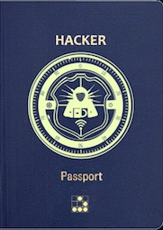

# Hacker Passport (ANZ) Easter Egg

## Hacker Passport ##
The Australia/New Zealand (ANZ) version of the Hacker Passport made its [debut](https://twitter.com/RobertWinkel/status/799054669746094080) 
at Kiwicon X in Wellington, NZ, which is where I acquired mine.  Its original inspiration came from the [DEFCON Hacker Passport](http://korben.info/wp-content/uploads/defcon/DEFCON-20-DIY-Hacker-Passport.pdf), 
with the idea being you receive a stamp for each infosec conference you attend.  Similar to how you would
receive an immigration stamp in a real passport when visiting a foreign country.  

It started with a suggestion by [Kylie](https://twitter.com/kylieengineer) to [Dook](https://twitter.com/dooktwit) that "we
should do [our own] hacker passport".  Dook mentioned this to [Bull](https://twitter.com/robertwinkel) who thought
it was "a cool idea" and ran with it, printing up a batch of passports, and thus we have the ANZ Hacker Passport\[1\]:    



*If you want one I would suggest hitting Bull up on Twitter; they were being sold for $5 AUD/NZD.*

### Machine Readable Zone (MRZ) ###
Passports have a machine readable zone (MRZ) at the bottom of the identity page.  The MRZ includes
information such as the type of passport, issuing country, and surname.  An example of a MRZ is circled
in red in the image below\[2\]:


On the identity page of our
Hacker Passport we also find a MRZ, although a bit different looking, containing the following text (and our Easter egg):
```
P<ANZHACKER-[------->+<]>-.-------.++.++++++++.---[->++++<]>.>-[--->+<]>-.------------.---.-[--
>+<]>--.[-->+++++<]>.----.-----------.+++++++++++++.---------.>-[--->+<]>-.M000000000000000
```
Hmm... after starring at it briefly I thought to myself its beginning to look a lot like ~~Christmas~~ Brainfuck.
Brain what?  Read on...

## Brainfuck ##
Before I discuss Brainfuck I need to give a shout out to [lxb](https://twitter.com/0x6c7862), as he previously
introduced me to the language.  If it had not been for that, I would have likely just seen the MRZ as random data put there for
cosmetic purposes only. 

Alright, so now that's done, what is Brainfuck?  Brainfuck is a Turing-complete esoteric programming language created in 1993 by Urban Müller, and notable for its
extreme minimalism.  It consists of only eight simple commands: `>`, `<`, `+`, `-`, `.`, `,`, `[`, and `]`\[3\].  Another shout out goes to
[Fatih Erikli](https://twitter.com/fthrkl) who created the [Brainfuck Visualiser](https://fatiherikli.github.io/brainfuck-visualizer/).
The animated visualisation really helped me get my head around it and grasp the concept of the language.  I'd highly recommend going to the site and running it
if you're new to Brainfuck.

### Interpreter ###
Since the language only has the above eight commands, I removed the other characters leaving the following: 
```
<-[------->+<]>-.-------.++.++++++++.---[->++++<]>.>-[--->+<]>-.------------.---.-[--
>+<]>--.[-->+++++<]>.----.-----------.+++++++++++++.---------.>-[--->+<]>-.
```
Next step was interpreting the Brainfuck, which could either be done manually (e.g. painfully and slow) or by just throwing it 
into a Brainfuck interpreter; I choose to go the less painful route.  A quick Google search returned an online JavaScript Brainfuck
interpreter at https://copy.sh/brainfuck/.  Entering in what I suspected was Brainfuck code and clicking `Run`
produced the following output (the text has been censored with X so not to spoil it just yet):

```
ÿøúüXXX XXXXXX
```

Damn.  It looked like I was correct in assuming it was Brainfuck, but I must have messed up when transcribing the code from the
passport.  It was immediately obvious to me what the text was suppose to say (you might already have guessed it yourself). I
transcribed it again from scratch, only to get the same result?!  After scratching my head briefly I decided to try
a "plaintext attack"--that is enter the plain text I assumed it to be and output the Brainfuck code.  Another quick Google
search and we land back at the same site, but on a different page: https://copy.sh/brainfuck/text.html.

## Easter Egg ##
I entered the text into the site and compared the output with my original transcription:

`<-[------->+<]>-.-------.++.++++++++.---[->++++<]>.>-[--->+<]>-.------------.---.-[-->+<]>--.[-->+++++<]>.----.-----------.+++++++++++++.---------.>-[--->+<]>-.`

`-[------->+<]>-.-------.++.++++++++.---[->++++<]>.>-[--->+<]>-.------------.---.-[-->+<]>--.[-->+++++<]>.----.-----------.+++++++++++++.---------.>-[--->+<]>-.`

In a split second I immediately noticed that I just needed to remove the first `<` in the MRZ.  With the extra `<` at the
start we get `ÿøúüTHE PLANET` (surely now you can see what it's supposed to be saying :P), but once I dropped that and put it
back into interpreter we correctly have our Easter egg output:

```
HACK THE PLANET
```

## Thanks ##
My first thought was this might have been the work of lxb.  It was very similiar to another Easter Egg he created for our
[Saltbush t-shirt](https://twitter.com/RobertWinkel/status/657225769551314944), and a much harder one for 
[SecTalks Brisbane "Encrypted 4" challenge](https://ring0.lol/posts/2016/04/28/sectalks-brisbane-encrypted-4-challenge/).
He was also the one who introduced me to Brainfuck, but he denied any [wrong]doing in it :D\[4\].  I ended up finding  out that it was actually Bull who
threw in the Easter Egg in the last 5 minutes before he sent it off to get printed\[5\].  Thanks for that Bull, I really enjoyed that little easter egg! :)  

Also, much thanks to Kylie, Dook, and Bull for being a part of making the Passport happen.

## References ##
\[1\] Online conversation with Bull, Dook, and Kylie.

\[2\] "Machine-readable passport", Wikipedia.org, 2016. [Online]. Available: https://en.wikipedia.org/wiki/Machine-readable_passport. [Accessed: 01DEC2016].

\[3\] "Brainfuck", Wikipedia.org, 2016. [Online].  Available:  https://en.wikipedia.org/wiki/Brainfuck. [Accessed: 01DEC2016].

\[4\] Online conversation with lxb. 

\[5\] Online conversation with Bull.
